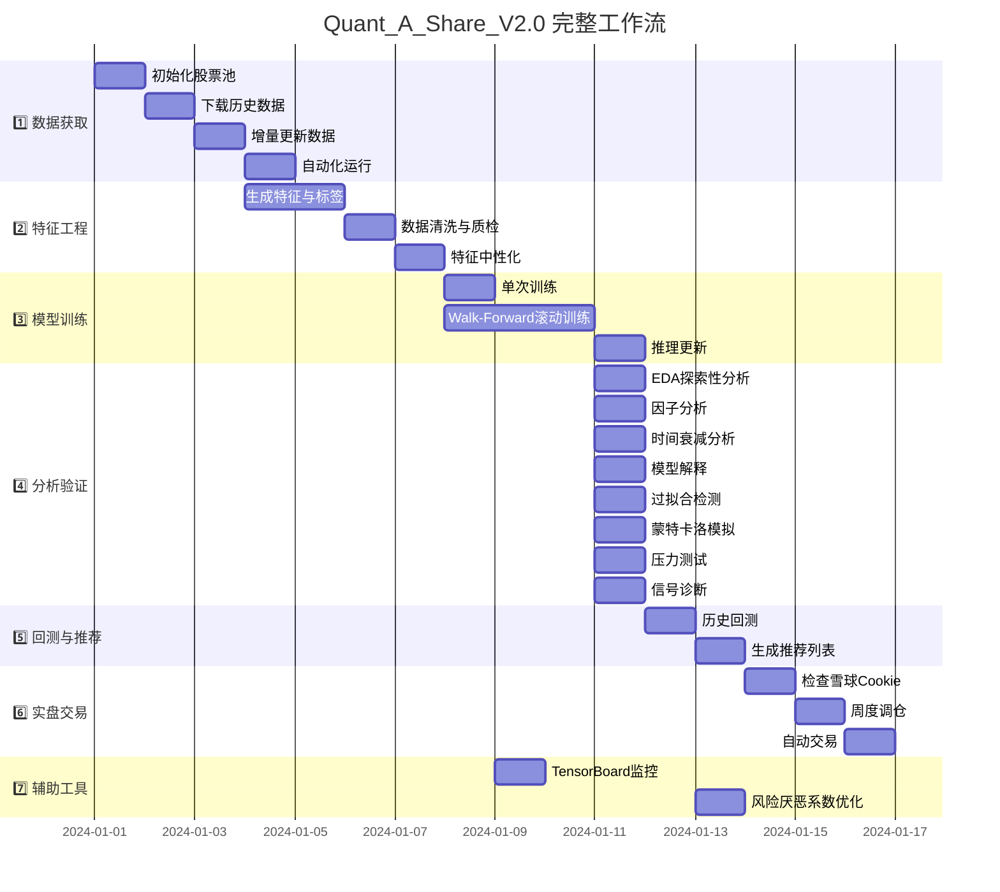

# Quant_A_Share_V2.0 架构说明

> 最后更新: 2025-01-19 | 版本: V2.2

---

## 📊 项目工作流甘特图



---

## 📁 项目目录结构

```
Quant_A_Share_V2.0/
├── config/                          # 配置中心
│   └── main.yaml                   # 统一配置文件
│
├── data/                            # 数据存储
│   ├── raw/                        # 原始行情数据
│   ├── raw_cleaned/                # 清洗后数据
│   ├── processed/                  # 特征工程后数据
│   │   ├── all_stocks.parquet     # 全市场特征数据
│   │   └── selected_features.txt  # 筛选后的特征列表
│   ├── models/                     # 模型文件
│   │   └── {version}/
│   │       ├── model_return.ubj   # 收益预测模型
│   │       ├── model_risk.ubj     # 风险预测模型
│   │       └── predictions.parquet # 预测结果
│   ├── meta/                       # 元数据
│   │   └── all_stocks_meta.parquet # 股票池信息
│   ├── index/                      # 指数数据
│   └── live_trading/               # 实盘配置
│
├── src/                             # 核心代码库
│   ├── data_source/                # 数据源模块
│   │   ├── base.py                # 数据源抽象基类
│   │   ├── baostock_source.py     # Baostock数据源
│   │   ├── akshare_source.py      # Akshare数据源
│   │   └── datahub.py             # 统一数据接口
│   │
│   ├── preprocessing/              # 预处理模块
│   │   ├── features.py            # 特征生成器
│   │   ├── labels.py              # 标签生成器
│   │   ├── neutralization.py      # 特征中性化
│   │   └── pipeline.py            # 完整预处理流水线
│   │
│   ├── model/                      # 模型模块
│   │   ├── xgb_model.py           # XGBoost模型封装
│   │   ├── lgb_model.py           # LightGBM模型封装
│   │   ├── trainer.py             # 训练器（支持双头模型）
│   │   └── training_monitor.py    # TensorBoard监控
│   │
│   ├── strategy/                   # 策略模块
│   │   └── signal.py              # 信号生成器
│   │
│   ├── backtest/                   # 回测模块
│   │   └── backtester.py          # 向量化回测引擎
│   │
│   ├── analysis/                   # 分析模块
│   │   ├── eda_engine.py          # 探索性数据分析
│   │   ├── factor_checker.py      # 因子分析
│   │   ├── horizon_analyzer.py    # 时间衰减分析
│   │   └── model_interpreter.py   # 模型解释（SHAP）
│   │
│   ├── live/                       # 实盘模块
│   │   ├── xueqiu_broker.py       # 雪球交易接口
│   │   ├── trading_scheduler.py   # 交易调度器
│   │   ├── trade_recorder.py      # 交易记录器
│   │   └── config.py              # 实盘配置
│   │
│   └── utils/                      # 工具模块
│       ├── config.py              # 配置加载器
│       ├── logger.py              # 日志工具
│       └── io.py                  # IO工具
│
├── scripts/                         # 可执行脚本
│   ├── date_landing/               # 数据下载
│   ├── feature_create/             # 特征生成
│   ├── model_train/                # 模型训练
│   ├── analisis/                   # 分析脚本
│   ├── back_test/                  # 回测与推荐
│   ├── live/                       # 实盘运行
│   └── tools/                      # 辅助工具
│
├── docs/                            # 文档
├── architecture/                    # 架构文档
└── logs/                            # 日志文件
```

---

## 🔧 核心脚本说明

### 1️⃣ 数据获取模块 (`scripts/date_landing/`)

| 脚本 | 功能 | 输入 | 输出 |
|------|------|------|------|
| `init_stock_pool.py` | 初始化股票池，获取全市场股票列表 | config/main.yaml | data/meta/all_stocks_meta.parquet |
| `download_data.py` | 批量下载历史行情数据 | 股票池 | data/raw/{symbol}.parquet |
| `update_data.py` | 增量更新最新行情数据 | 已有数据 | 更新data/raw/ |
| `auto_run.py` | 自动化数据更新任务（定时运行） | - | 自动更新数据 |

**核心流程**：
```
初始化股票池 → 下载历史数据 → 定期增量更新
```

---

### 2️⃣ 特征工程模块 (`scripts/feature_create/`)

| 脚本 | 功能 | 输入 | 输出 |
|------|------|------|------|
| `rebuild_features.py` | 执行完整的特征工程流水线 | data/raw/ | data/processed/all_stocks.parquet |

**生成的特征类型**：
- **基础特征**：对数收益率、振幅
- **均线特征**：MA5/10/20/60 乖离率
- **技术指标**：MACD、RSI、KDJ、布林带
- **量能特征**：成交量比率、换手率
- **波动率特征**：ATR、标准差
- **斜率特征**：RSI斜率、MACD斜率、均线角度
- **量价相关性**：价格与成交量的滚动相关系数
- **市值特征**：对数市值

**生成的标签类型**：
- **收益标签** (`label`)：N日后的超额收益（相对指数）
- **风险标签** (`label_risk`)：下行偏差/波动率/最大回撤

---

### 3️⃣ 模型训练模块 (`scripts/model_train/`)

| 脚本 | 功能 | 输入 | 输出 |
|------|------|------|------|
| `train_model.py` | 单次模型训练 | all_stocks.parquet | data/models/{version}/ |
| `run_walkforward.py` | Walk-Forward滚动训练（按年） | all_stocks.parquet | 多个年度模型 |
| `run_inference_update.py` | 使用已训练模型进行推理 | 模型 + 新数据 | predictions.parquet |

**模型架构**：
- **双头模型**（Dual-Head Model）
  - **收益预测头**：预测未来N日的超额收益
  - **风险预测头**：预测未来N日的下行风险
  - **融合策略**：Sharpe-like比率、效用函数、排名比率等

**支持的模型类型**：
- XGBoost（GPU加速）
- LightGBM

**训练监控**：
- TensorBoard实时监控训练过程
- 记录损失曲线、特征重要性、超参数

---

### 4️⃣ 分析验证模块 (`scripts/analisis/`)

| 脚本 | 功能 | 说明 |
|------|------|------|
| `run_eda.py` | 探索性数据分析 | 数据分布、异常检测、缺失值分析 |
| `check_features.py` | 因子分析 | IC值、相关性、特征重要性 |
| `check_time_horizon.py` | 时间衰减分析 | 预测信号的有效期分析 |
| `explain_model.py` | 模型解释 | SHAP值分析、特征贡献度 |
| `check_overfit.py` | 过拟合检测 | 随机标签测试、训练集vs验证集对比 |
| `check_monte_carlo.py` | 蒙特卡洛模拟 | 噪声敏感性、权重扰动测试 |
| `check_stress_test.py` | 压力测试 | 熊市生存测试、成本敏感性分析 |
| `signal_diagnosis.py` | 信号诊断 | 持仓分布、换手率、动量分析 |
| `check_return_distribution.py` | 收益分布分析 | 收益率分布、偏度、峰度 |
| `check_result_validity.py` | 结果有效性检验 | 统计显著性测试 |
| `feature_selector.py` | 特征筛选 | 基于IC和相关性自动筛选特征 |
| `return_attribution.py` | 收益归因分析 | 分解收益来源 |
| `analyze_threshold.py` | 阈值分析 | 优化选股阈值 |
| `clean_and_check.py` | 数据清洗与检查 | 数据质量检查 |

---

### 5️⃣ 回测与推荐模块 (`scripts/back_test/`)

| 脚本 | 功能 | 输入 | 输出 |
|------|------|------|------|
| `run_backtest.py` | 历史回测 | predictions.parquet | 回测报告、净值曲线 |
| `run_recommendation.py` | 生成推荐列表 | 最新预测 | 推荐股票列表 |

**回测引擎特性**：
- **向量化计算**：高效处理大规模数据
- **多种买入模式**：开盘价/均价/收盘价
- **换仓模式**：滚动换仓/定期换仓
- **成本模拟**：交易成本、滑点、涨停无法买入
- **绩效指标**：年化收益、夏普比率、最大回撤、胜率

---

### 6️⃣ 实盘交易模块 (`scripts/live/`)

| 脚本 | 功能 | 说明 |
|------|------|------|
| `check_xq_cookie.py` | 检查雪球Cookie有效性 | 验证登录状态 |
| `run_weekly_rebalance.py` | 周度调仓 | 每周执行一次调仓 |
| `run_auto_trading.py` | 自动交易 | 自动执行买卖操作 |

**实盘对接**：
- 支持雪球组合交易
- 自动读取持仓、执行调仓
- 记录交易日志

---

### 7️⃣ 辅助工具 (`scripts/tools/`)

| 脚本 | 功能 | 说明 |
|------|------|------|
| `start_tensorboard.py` | 启动TensorBoard | 可视化训练过程 |
| `optimize_risk_aversion.py` | 优化风险厌恶系数 | 网格搜索最优参数 |

---

## 🔄 典型使用流程

### 场景1：首次使用（完整流程）

```bash
# 1. 初始化股票池
python scripts/date_landing/init_stock_pool.py

# 2. 下载历史数据
python scripts/date_landing/download_data.py

# 3. 生成特征
python scripts/feature_create/rebuild_features.py

# 4. 训练模型（Walk-Forward）
python scripts/model_train/run_walkforward.py

# 5. 分析验证
python scripts/analisis/run_eda.py
python scripts/analisis/check_features.py
python scripts/analisis/explain_model.py

# 6. 回测
python scripts/back_test/run_backtest.py

# 7. 生成推荐
python scripts/back_test/run_recommendation.py
```

### 场景2：日常更新

```bash
# 1. 更新数据
python scripts/date_landing/update_data.py

# 2. 重新生成特征
python scripts/feature_create/rebuild_features.py

# 3. 推理更新
python scripts/model_train/run_inference_update.py

# 4. 生成推荐
python scripts/back_test/run_recommendation.py
```

### 场景3：实盘交易

```bash
# 1. 检查Cookie
python scripts/live/check_xq_cookie.py

# 2. 周度调仓（每周一运行）
python scripts/live/run_weekly_rebalance.py
```

---

## 📊 数据流图

```mermaid
graph LR
    A[原始数据源] -->|下载| B[data/raw/]
    B -->|特征工程| C[data/processed/all_stocks.parquet]
    C -->|训练| D[data/models/{version}/]
    D -->|预测| E[predictions.parquet]
    E -->|回测| F[回测报告]
    E -->|推荐| G[推荐列表]
    G -->|实盘| H[雪球交易]
```

---

## 🎯 核心设计原则

1. **配置驱动**：所有参数集中在 `config/main.yaml`
2. **模块解耦**：数据源、特征、模型、策略独立可替换
3. **数据契约**：统一的数据格式（parquet）和列命名规范
4. **向量化计算**：避免循环，提升性能
5. **可复现性**：固定随机种子、记录完整日志

---

## 📝 命名规范

| 类型 | 前缀 | 示例 |
|------|------|------|
| 特征列 | `feat_` | `feat_rsi_14`, `feat_macd` |
| 标签列 | `label_` | `label`, `label_risk` |
| 预测列 | `pred_` | `pred_return`, `pred_risk`, `pred_score` |
| 配置版本 | 时间戳 | `20250119_173534` |

---

## 🔧 关键配置项

### 数据配置
- `data.source`: 数据源选择（baostock/akshare）
- `data.stock_pool`: 股票池过滤规则

### 特征配置
- `preprocessing.features`: 启用的特征类型
- `preprocessing.labels.horizon`: 预测周期（天数）
- `preprocessing.labels.return_mode`: 收益模式（absolute/excess_index）

### 模型配置
- `model.dual_head.enable`: 是否启用双头模型
- `model.dual_head.fusion.method`: 融合方法（sharpe_like/utility/rank_ratio）
- `model.walk_forward.enable`: 是否启用滚动训练

### 策略配置
- `strategy.top_k`: 选股数量
- `strategy.rebalance_mode`: 换仓模式（rolling/periodic）
- `strategy.entry_price`: 买入价格模式（open/vwap/close）

---

## 📈 性能指标

基于历史回测（2017-2024）：
- **年化收益率**：~78%
- **夏普比率**：~5.75
- **最大回撤**：~-15%
- **胜率**：~65%

---

## 🚀 未来规划

- [ ] 深度学习模型（LSTM/Transformer）
- [ ] 多因子融合框架
- [ ] Web可视化界面
- [ ] 更多券商API对接
- [ ] 实时行情接入

---

**文档维护者**：Quant Team  
**最后更新**：2025-01-19
</contents>